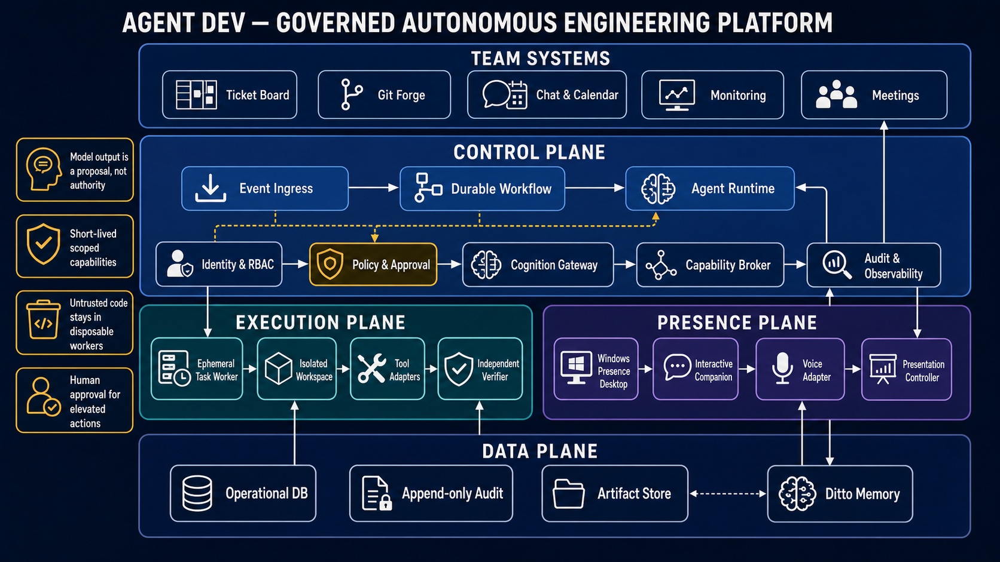

# Agent Dev architecture

This repository is a **design package**, not a working implementation.

[Open the full-resolution architecture image](agent-dev-architecture-v2.png).

`primary_messy_design.md` is the original product idea and is intentionally left unchanged.
The remaining documents turn that idea into a safer, testable architecture:

1. [Architecture v2](first_high_level_architecture.md) — canonical system architecture.
2. [Design index](design/00_overview.md) — component and supporting-document map.
3. [Requirements](design/requirements.md) — goals, non-goals, autonomy levels, and acceptance criteria.
4. [Critical review](design/review-findings.md) — weaknesses in the original and v1 designs, with dispositions.
5. [Contracts and data](design/contracts-and-data.md) — workflow states, event envelopes, commands, approvals, and memory records.
6. [Operations and evaluation](design/operations-and-evaluation.md) — SLOs, telemetry, recovery, quality gates, and test strategy.
7. [Delivery plan](design/delivery-plan.md) — risk-first increments and demo scope.

Component designs live under [`design/`](design/00_overview.md).

## Status

- Product idea: captured.
- Architecture: proposed v2; decisions marked **proposed** still need stakeholder validation.
- Implementation: not present in this repository.
- Security certification or production readiness: not claimed.

## Reading rule

Normative statements use **MUST**, **SHOULD**, and **MAY**. Claims such as “never dies,”
“zero leaks,” or “fully autonomous” are not guarantees unless they have a measurable SLO,
an enforcement mechanism, and a test.
